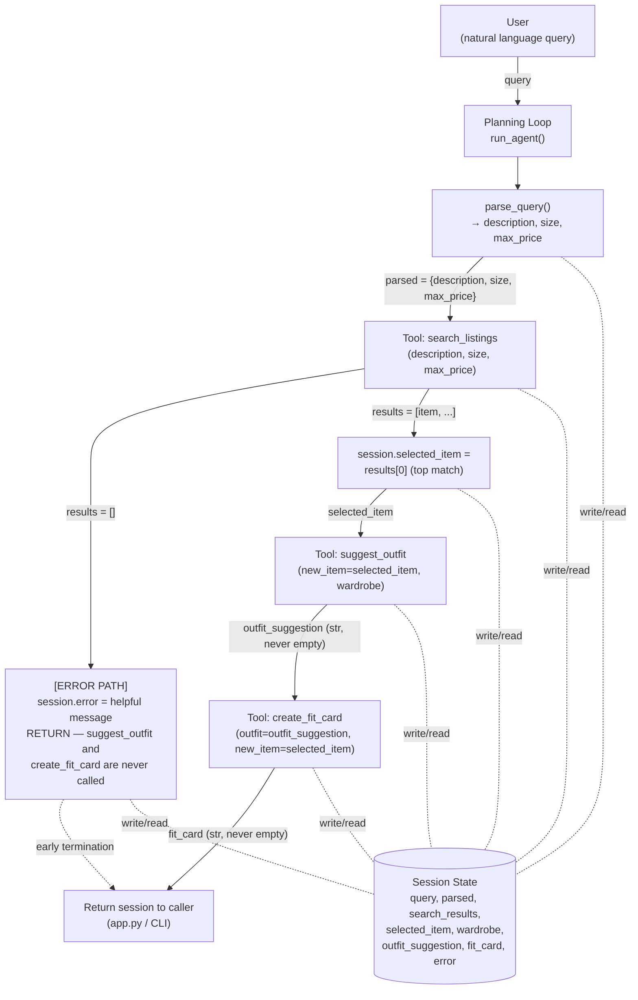

# FitFindr 🛍️

FitFindr is a multi-tool AI agent that helps users find secondhand pieces and figure out how to wear them. Give it one natural-language request and it searches a mock listings dataset, suggests how to style the top match against your wardrobe, and writes a shareable caption for it — deciding what to do next based on what each step actually returns, not by running a fixed pipeline.

## Setup

```bash
python -m venv .venv
source .venv/bin/activate          # Mac/Linux
pip install -r requirements.txt
```

Create a `.env` file in the repo root (never committed — already in `.gitignore`):
```
GROQ_API_KEY=your_key_here
```
Get a free key at [console.groq.com](https://console.groq.com).

Verify the data loads correctly:
```bash
python utils/data_loader.py
```

Run the tests:
```bash
pytest tests/
```

Run the app:
```bash
python app.py
```
Then open the URL printed in the terminal (usually `http://localhost:7860`).

---

## Tools

### `search_listings(description, size=None, max_price=None)`

| | |
|---|---|
| **Inputs** | `description` (str) — free-text keywords, e.g. `"vintage graphic tee"`. `size` (str \| None) — case-insensitive substring match against the listing's size field, e.g. `"M"` matches `"S/M"`; `None` skips size filtering. `max_price` (float \| None) — inclusive price ceiling; `None` skips price filtering. |
| **Returns** | `list[dict]` of listing dicts (`id`, `title`, `description`, `category`, `style_tags`, `size`, `condition`, `price`, `colors`, `brand`, `platform`), sorted best-match-first. `[]` if nothing matches. |
| **Purpose** | Filters the 40-item mock dataset by price/size, then scores the remainder by keyword overlap — title matches count for 3 points, category/specific style-tag matches for 2, description matches for 1, and a handful of generic vibe words shared by most of the dataset (`vintage`, `classic`, `streetwear`, etc.) for only 0.5. A listing needs a score ≥ 2 to be returned, so a single generic-word overlap (e.g. a leather belt tagged "vintage") can't surface for a query like "vintage graphic tee." |

### `suggest_outfit(new_item, wardrobe)`

| | |
|---|---|
| **Inputs** | `new_item` (dict) — a listing dict, typically the top result from `search_listings`. `wardrobe` (dict) — a dict with an `items` key (list of wardrobe item dicts: `id`, `name`, `category`, `colors`, `style_tags`, `notes`). May have an empty `items` list. |
| **Returns** | `str` — 1-2 outfit combinations in natural language. Never empty. |
| **Purpose** | Asks Groq's `llama-3.3-70b-versatile` to pair the new item with specific named pieces from the wardrobe. If the wardrobe has no items, it switches to a different prompt asking for general styling advice instead, and says so in the response. |

### `create_fit_card(outfit, new_item)`

| | |
|---|---|
| **Inputs** | `outfit` (str) — the suggestion string from `suggest_outfit`. `new_item` (dict) — the listing dict (for title/price/platform). |
| **Returns** | `str` — a 2-4 sentence shareable caption mentioning the item, price, and platform once each. Never empty. |
| **Purpose** | Turns the outfit suggestion into something that reads like a real OOTD caption rather than a product blurb. Uses `temperature=1.0` so repeated calls on the same input produce different phrasing — verified in `tests/test_tools.py::test_create_fit_card_varies_across_calls`. |

---

## Planning Loop

The agent is **not** a fixed three-call pipeline — it's a sequence with one real decision point, and everything downstream of that decision depends on what came before it:

```
session = _new_session(query, wardrobe)
session.parsed = parse_query(query)                  # description, size, max_price

results = search_listings(**session.parsed)
session.search_results = results

if results == []:
    session.error = "No listings matched '<description>' under $<max_price>
                      in size <size>. Try raising your max price, removing
                      the size filter, or using broader keywords."
    return session                                     # STOP — suggest_outfit and
                                                         # create_fit_card never run

session.selected_item = results[0]                     # top-scored match

session.outfit_suggestion = suggest_outfit(session.selected_item, session.wardrobe)
session.fit_card = create_fit_card(session.outfit_suggestion, session.selected_item)
return session
```

**The branch that matters:** after `search_listings` runs, the agent checks whether anything came back. If not, it sets a specific, actionable error message (naming the exact description/size/price that were searched) and returns immediately — `suggest_outfit` and `create_fit_card` are never invoked with nothing to work with. If there are results, the top-scored listing becomes `selected_item` and the rest of the flow proceeds.

Once past that branch, `suggest_outfit` and `create_fit_card` are called unconditionally — but this isn't "ignoring context," it's because each of those tools is designed to absorb its *own* failure modes internally (see Error Handling below) and guarantees a non-empty, useful string back. The loop doesn't need to branch around them because they never produce nothing to branch on.

**Query parsing:** `description`/`size`/`max_price` are extracted with plain regex and keyword matching (`agent.py::_parse_query`), not an LLM call. This keeps parsing deterministic and fast; the LLM is reserved for the two tools that are actually generative.

**Termination:** the loop ends the moment either `session["error"]` is set (early exit) or `session["fit_card"]` is set (normal completion) — there's nothing left to decide once either field is populated.

---

## State Management

A single session dict, built once by `_new_session()` and threaded through the whole interaction, is the only channel tools use to talk to each other:

| Field | Set by | Read by |
|---|---|---|
| `query` | caller | `_parse_query` |
| `parsed` | `_parse_query` | `search_listings` (as kwargs) |
| `search_results` | `search_listings` | loop (to pick `selected_item`) |
| `selected_item` | loop (`results[0]`) | `suggest_outfit`, `create_fit_card` |
| `wardrobe` | caller | `suggest_outfit` |
| `outfit_suggestion` | `suggest_outfit` | `create_fit_card` |
| `fit_card` | `create_fit_card` | caller (final output) |
| `error` | loop, on early exit | caller (checked first) |

The concrete proof that state actually flows rather than being re-entered: `session["selected_item"] is session["search_results"][0]` — the same dict object found by `search_listings` is passed unmodified into both `suggest_outfit` and `create_fit_card`. The user never re-types the item name, price, or platform between steps.

---

## Error Handling

Every tool returns a string or list describing what happened, even on failure. Nothing in the pipeline raises an uncaught exception or returns silently empty data.

| Tool | Failure mode | Response |
|---|---|---|
| `search_listings` | No listings match | Returns `[]` (never raises). The agent then sets `session["error"]` to a specific message and stops — it does **not** call `suggest_outfit`/`create_fit_card` with nothing to style. |
| `suggest_outfit` | Wardrobe is empty | Switches to a general-styling LLM prompt instead of a wardrobe-pairing one, and tells the user it's giving general advice. |
| `suggest_outfit` / `create_fit_card` | Groq API call raises | Caught internally; returns a descriptive fallback string referencing the item directly, so the rest of the flow can still complete. |
| `create_fit_card` | `outfit` is empty/whitespace | Skips the LLM call entirely and returns a message explaining a fit card can't be built without an outfit suggestion. |

**Concrete example from testing** — running the exact no-results trigger from the project spec:
```
$ python -c "from tools import search_listings; print(search_listings('designer ballgown', size='XXS', max_price=5))"
[]
```
and the full agent's response to the same query:
```
No listings matched 'designer ballgown' under $5.00 in size XXS. Try raising
your max price, removing the size filter, or using broader keywords.
```
`session["selected_item"]`, `session["outfit_suggestion"]`, and `session["fit_card"]` all remain `None` — confirmed by direct inspection during testing.

---

## Architecture



The only branch point in the control flow is directly after `search_listings`. Every other arrow is unconditional once that branch is past, because each tool downstream absorbs its own failure modes rather than pushing them back up to the loop.

---

## Spec Reflection

**Where the spec helped:** Writing out `search_listings`' exact return shape and failure mode in `planning.md` *before* implementing it is what caught a real bug. The first implementation matched the letter of the spec ("drop listings with a score of 0") but not its intent — a leather belt tagged `vintage` was scoring nonzero against a "vintage graphic tee" query and showing up in results. Because the spec had already committed to "sorted by relevance, best match first" as the return contract, it was obvious during testing that a belt ranking anywhere in that list was a spec violation in spirit, not just a rough edge — which is what justified going back and tightening the scoring (downweighting generic tags, requiring a minimum score) rather than shipping it as-is.

**Where implementation diverged from the spec, and why:** `planning.md` originally described `suggest_outfit`'s failure handling as "catches the exception and returns a fallback string... The agent still proceeds to `create_fit_card` using this fallback text." In the actual `run_agent()` implementation, there's no explicit `try/except` or conditional check around the `suggest_outfit` call in the loop itself — the loop calls it unconditionally. This isn't a gap; it's a deliberate simplification once I'd already pushed all of that error-catching *inside* `suggest_outfit` (and `create_fit_card`) rather than in the loop. Since both tools guarantee a non-empty string return no matter what happens internally, the loop never needs to branch on their output — it just stores whatever comes back. I kept the planning.md language describing the fallback behavior (it's still true, the fallback still happens) but the actual control flow is simpler than the original phrasing implied, because the responsibility for handling the failure sits entirely inside the tool rather than split between the tool and the loop.

---

## AI Usage

This project was built with Claude Code. Two concrete instances:

1. **Implementing `tools.py`.** Input given: the "Tools" section of `planning.md` (exact parameter names/types, return shapes, failure-mode descriptions for all three tools) plus the pre-written docstrings/TODOs already in `tools.py`. Claude produced an initial `search_listings` that scored every listing by simple keyword overlap with no weighting. I tested it against the dataset and found it returned a leather belt for the query "vintage graphic tee" — both were tagged `vintage`, and any nonzero score qualified. I had Claude revise the scoring to weight title matches highest, downweight a fixed set of generic style tags (`vintage`, `classic`, `streetwear`, etc.) that appear across unrelated categories, and require a minimum score before a listing qualifies. I re-ran the same query and several others (`90s track jacket size M`, `flowy midi skirt under $40`) before accepting it.

2. **Implementing the planning loop in `agent.py`.** Input given: the Planning Loop, State Management, and Architecture (Mermaid diagram) sections of `planning.md`, plus the numbered TODO steps in `run_agent()`'s docstring. The first generated version of the query parser left leftover words like "under" in the parsed `description` (e.g. parsing `"...under $30"` produced `description="vintage graphic tee under"`), which would have hurt `search_listings`' keyword scoring. I caught this by printing `_parse_query()` output directly against several example queries, then had Claude fix the regex to strip the full "under $N" phrase as one unit and to cut the description off at wardrobe-describing clauses (e.g. "I mostly wear...") before they leaked into the search keywords.

In both cases, the verification step was running the actual functions against real queries from the dataset and checking the output by hand — not just trusting that the generated code matched the spec on read-through.

---

## Demo

The demo video shows a complete interaction through all three tools (search → outfit → fit card) with the matched item and outfit suggestion narrated as they flow between tool calls, plus the no-results error path triggered deliberately to show the agent's graceful failure response.
