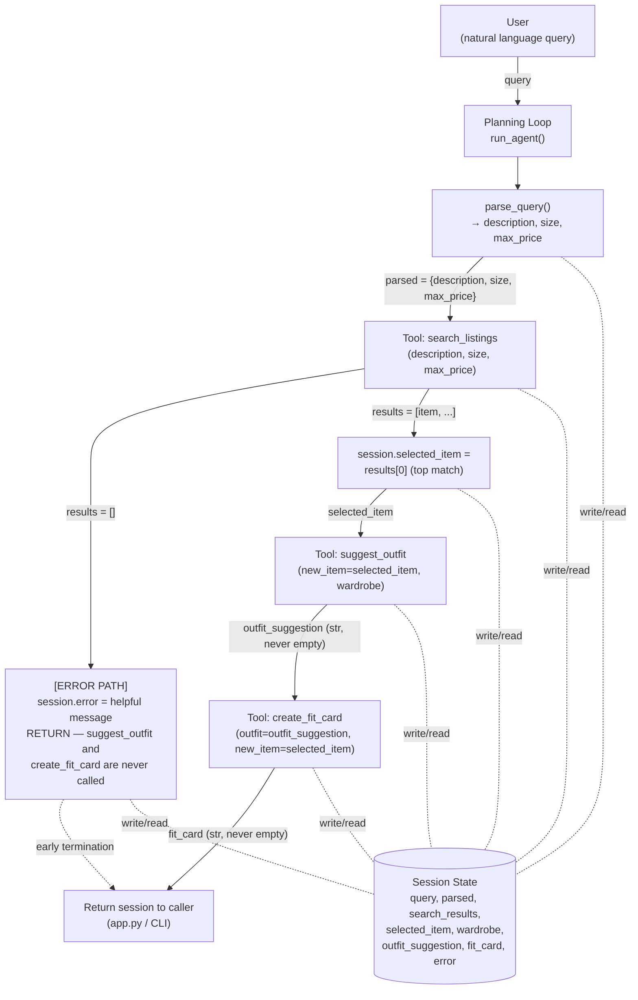

# FitFindr — planning.md

> Complete this document before writing any implementation code.
> Your spec and agent diagram are what you'll use to direct AI tools (Claude, Copilot, etc.) to generate your implementation — the more specific they are, the more useful the generated code will be.
> Your planning.md will be reviewed as part of your submission.
> Update it before starting any stretch features.

---

## Tools

List every tool your agent will use. For each tool, fill in all four fields.
You must have at least 3 tools. The three required tools are listed — add any additional tools below them.

### Tool 1: search_listings

**What it does:**
Searches the mock listings dataset (`data/listings.json`, loaded via `load_listings()`) for items that match a free-text description, and optionally filters by size and a maximum price. Results are scored by keyword overlap and returned best-match first.

**Input parameters:**
- `description` (str): Free-text keywords describing what the user wants (e.g. "vintage graphic tee"). Matched against the listing's `title`, `description`, and `style_tags`.
- `size` (str | None): Size string to filter by, case-insensitive substring match (e.g. `"M"` matches `"S/M"`). `None` skips size filtering.
- `max_price` (float | None): Inclusive price ceiling. `None` skips price filtering.

**What it returns:**
A `list[dict]` of matching listing dicts (same shape as the dataset: `id`, `title`, `description`, `category`, `style_tags`, `size`, `condition`, `price`, `colors`, `brand`, `platform`), sorted by relevance score, highest first. Returns `[]` if nothing matches — never raises.

**What happens if it fails or returns nothing:**
The agent does not call `suggest_outfit` or `create_fit_card`. It sets `session["error"]` to a message telling the user what was searched for and suggesting they loosen a constraint (drop the size filter, raise the price ceiling, or use broader keywords), then returns the session immediately.

---

### Tool 2: suggest_outfit

**What it does:**
Given a specific listing the user is considering and their existing wardrobe, asks the LLM to suggest 1–2 complete outfit combinations that pair the new item with specific named wardrobe pieces (or general styling advice if the wardrobe is empty).

**Input parameters:**
- `new_item` (dict): A listing dict (the item under consideration), typically `session["selected_item"]` from `search_listings`.
- `wardrobe` (dict): A wardrobe dict with an `items` key (list of wardrobe item dicts per `wardrobe_schema.json`). May have an empty `items` list.

**What it returns:**
A non-empty `str` describing one or more outfit combinations in natural language, referencing specific wardrobe items by name when available.

**What happens if it fails or returns nothing:**
- If `wardrobe["items"]` is empty: the tool does not fail — it calls the LLM with a "general styling advice" prompt instead of a "pair with these items" prompt, and tells the user it's giving general advice because no wardrobe was found.
- If the LLM call itself raises (network/API error) or returns an empty string: the tool catches the exception and returns a fallback string ("Couldn't generate a personalized outfit suggestion right now — here's the item on its own: ...") rather than propagating the exception. The agent still proceeds to `create_fit_card` using this fallback text, since a fit card can still be produced.

---

### Tool 3: create_fit_card

**What it does:**
Turns the outfit suggestion and the new item's details into a short, casual, shareable caption — the kind of text someone would post alongside an OOTD photo.

**Input parameters:**
- `outfit` (str): The outfit suggestion string returned by `suggest_outfit`.
- `new_item` (dict): The listing dict for the thrifted item (for name, price, platform).

**What it returns:**
A 2–4 sentence `str` caption that mentions the item, price, and platform once each, captures the outfit vibe, and reads like a real social post (not a product blurb). Uses a higher LLM temperature so repeated calls with different inputs produce varied phrasing.

**What happens if it fails or returns nothing:**
If `outfit` is empty/whitespace-only or `new_item` is missing required fields (title/price/platform), the tool does not call the LLM — it returns a descriptive string explaining the caption couldn't be generated and why (e.g. "Can't build a fit card without outfit details — try running suggest_outfit first."). If the LLM call raises, the tool catches the exception and returns a similar descriptive fallback string. It never raises and never returns `""`.

---

### Additional Tools (if any)

_None implemented yet for the required scope. Stretch tool (`check_price_fairness`) will be added here with full spec before that work starts, per the stretch-feature instructions._

---

## Planning Loop

**How does your agent decide which tool to call next?**

The loop is a straight-line sequence with conditional early exits — not a fixed pipeline that runs regardless of outcome, because at each step the *next* call depends on what the previous tool actually returned. In pseudocode:

```
session = _new_session(query, wardrobe)
session.parsed = parse_query(query)              # description, size, max_price

results = search_listings(**session.parsed)
session.search_results = results

if results == []:
    session.error = f"No listings matched '{session.parsed.description}'
                       under ${session.parsed.max_price} in size {session.parsed.size}.
                       Try a higher price, a different size, or broader keywords."
    return session                                 # STOP — do not call suggest_outfit

session.selected_item = results[0]                 # top-scored match

outfit = suggest_outfit(session.selected_item, session.wardrobe)
session.outfit_suggestion = outfit                 # never "", tool guarantees this

card = create_fit_card(outfit, session.selected_item)
session.fit_card = card                             # never "", tool guarantees this

return session
```

Branch-by-branch:
- **After `search_listings` runs:** check `len(results) == 0`. If true, set `session["error"]` to a message naming the exact description/size/max_price that were searched, and `return session` immediately — `suggest_outfit` and `create_fit_card` are never called. If false, set `session["selected_item"] = results[0]` (highest relevance score) and continue.
- **After `suggest_outfit` runs:** this call is unconditional once the search branch succeeds — there's no further branching at the loop level, because the tool itself absorbs its own failure modes (empty wardrobe → general-advice prompt; LLM error → fallback string) and always returns a usable non-empty string. The loop just stores whatever string comes back into `session["outfit_suggestion"]` and proceeds.
- **After `create_fit_card` runs:** also unconditional — the tool guards against an empty `outfit` input internally and always returns a non-empty string (either a real caption or a descriptive "couldn't generate" message). The loop stores the result in `session["fit_card"]` and the interaction is done.
- **Termination condition:** the loop ends the moment either (a) `session["error"]` is set (early exit after step 2), or (b) `session["fit_card"]` is set (normal completion). There is no retry-and-continue inside `run_agent()` itself for the required scope — the "loosen constraints and retry automatically" behavior is the Retry Logic stretch feature, not part of the base loop.

The key "planning" behavior is the branch after `search_listings`: the agent's visible behavior changes (full 3-tool flow vs. early stop with a helpful message) based on what that one call returns. This is what's demoed in the no-results path in the demo video.

**Query parsing approach:** simple rule-based parsing (regex for `$<number>` → `max_price`, a small set of size tokens like `XS/S/M/L/XL` and numeric sizes → `size`, remainder of the query minus filler words → `description`). Documented here rather than using an LLM call for parsing, to keep the parse step deterministic and fast — the LLM is reserved for the two genuinely generative tools (`suggest_outfit`, `create_fit_card`).

---

## State Management

**How does information from one tool get passed to the next?**

A single session dict (built by `_new_session()` in `agent.py`) is threaded through the whole interaction and is the only channel tools communicate through — no tool reads global state or re-prompts the user mid-flow:

- `query` — the raw user input, kept for reference/debugging.
- `parsed` — `{description, size, max_price}` extracted from `query`; fed directly as kwargs into `search_listings`.
- `search_results` — full list returned by `search_listings`; kept so the UI/demo can show "3 matches found" even though only the top one is used.
- `selected_item` — `search_results[0]`; this is the dict passed as `new_item` into both `suggest_outfit` and `create_fit_card`. This is the concrete answer to "how does state flow between tools" — the same dict object flows unmodified into two downstream tool calls.
- `wardrobe` — passed in by the caller (`run_agent(query, wardrobe)`); passed unmodified into `suggest_outfit`.
- `outfit_suggestion` — string returned by `suggest_outfit`; passed as the `outfit` argument into `create_fit_card`.
- `fit_card` — final string returned by `create_fit_card`; this is what gets shown to the user.
- `error` — `None` on success; set the moment any step decides the flow can't continue, and checked by both the CLI and the Gradio app before reading the other fields.

Because every tool is a pure function (`dict/str in → dict/str out`, no shared mutable globals), the session dict is sufficient — there's no need for a class or external store for a single-interaction session.

---

## Error Handling

For each tool, describe the specific failure mode you're handling and what the agent does in response.

| Tool | Failure mode | Agent response |
|------|-------------|----------------|
| search_listings | No results match the query (empty list returned) | Agent sets `session["error"]` to a specific, actionable message and stops — e.g. `"No listings matched 'designer ballgown' under $5.00 in size XXS. Try raising your max price, removing the size filter, or using broader keywords like 'dress' instead of 'ballgown'."` It does not call `suggest_outfit` or `create_fit_card` with no item to work with. |
| suggest_outfit | Wardrobe is empty (`wardrobe["items"] == []`) | Tool does not fail — it calls the LLM with a general-styling prompt and prefixes the result so the user knows it's not personalized, e.g. `"No wardrobe on file yet, so here's general styling advice: this faded band tee pairs well with..."`. The agent still proceeds to `create_fit_card` with this text — a fit card is still useful even without a personalized pairing. |
| suggest_outfit | LLM call raises (network/API/timeout error) | Tool catches the exception and returns `"Couldn't generate a personalized outfit suggestion right now (styling service unavailable). Here's the item on its own: <title> — $<price> on <platform>."` so the agent can still proceed to `create_fit_card` instead of crashing the whole interaction. |
| create_fit_card | Outfit input is missing or incomplete (empty/whitespace string) | Tool skips the LLM call entirely and returns `"Can't create a fit card without an outfit suggestion — try running suggest_outfit first, or check that it returned a non-empty result."` No exception is raised; the agent surfaces this string directly to the user as the fit-card output. |
| create_fit_card | LLM call raises | Tool catches the exception and returns `"Couldn't generate a fit card right now (caption service unavailable). Here's the basic info: <title> styled as: <outfit>, found for $<price> on <platform>."` rather than propagating the error up to the Gradio UI or CLI. |

General principle used everywhere: every tool returns a string/list describing what happened, even on failure — nothing in the pipeline raises an uncaught exception or returns silently empty data without the agent explaining why.

---

## Architecture



**Reading the diagram:** every tool call both reads from and writes to the single session-state dict (dashed lines) rather than passing data directly node-to-node outside of it — `selected_item`, for example, is written once after `search_listings` and then read by both `suggest_outfit` and `create_fit_card` without the user re-entering it. The only branch point in the control flow is directly after `search_listings`: an empty result list takes the dashed "early termination" path straight to `Return`, skipping both remaining tools entirely.

---

## AI Tool Plan

**Milestone 3 — Individual tool implementations:**
- Tool: Claude (Claude Code, in this repo).
- Input given: the docstring/TODO block already in `tools.py` for each function, plus the corresponding "Tool N" section above (inputs, return shape, failure mode).
- Expected output: a working implementation of `search_listings`, `suggest_outfit`, and `create_fit_card` that matches the documented signatures and return types exactly, using `load_listings()` from `utils/data_loader.py` and the Groq client helper already stubbed in `tools.py`.
- Verification: run each tool standalone (e.g. `python -c "from tools import search_listings; print(search_listings('vintage graphic tee', max_price=30))"`) against at least 3 cases per tool before wiring into `agent.py`: a normal match, a no-match/empty case, and an edge case (empty wardrobe for `suggest_outfit`, empty outfit string for `create_fit_card`).

**Milestone 4 — Planning loop and state management:**
- Tool: Claude (Claude Code, in this repo).
- Input given: the completed Planning Loop, State Management, Error Handling, and Architecture sections above, plus the TODO steps already in `agent.py`'s `run_agent()` docstring.
- Expected output: `run_agent()` implemented exactly per the 7 steps in its docstring, populating the session dict described in State Management, with the early-exit behavior described in the Planning Loop section.
- Verification: run `python agent.py` and confirm both the happy-path (`session["error"] is None`, all three fields populated) and no-results-path (`session["error"]` is a helpful message, other fields stay `None`) print as expected; then wire `handle_query()` in `app.py` and manually test the same two paths plus an empty-wardrobe case through the Gradio UI.

---

## A Complete Interaction (Step by Step)

Write out what a full user interaction looks like from start to finish — tool call by tool call. Use a specific example query.

**What FitFindr needs to do:** FitFindr takes one natural-language request and turns it into a matched secondhand item, a styling suggestion, and a ready-to-post caption, without making the user re-describe the item at each step. A successful search triggers `suggest_outfit` on the top match, and a non-empty outfit suggestion triggers `create_fit_card`; an empty `search_listings` result short-circuits the whole flow — the agent reports what was searched for and suggests loosening a constraint instead of calling the remaining tools with nothing to work with.

**Example user query:** "I'm looking for a vintage graphic tee under $30. I mostly wear baggy jeans and chunky sneakers. What's out there and how would I style it?"

**Step 1:**
The agent parses the query: `description="vintage graphic tee"`, `size=None` (no size mentioned), `max_price=30.0`. It calls `search_listings("vintage graphic tee", size=None, max_price=30.0)`. Against the dataset this matches listings tagged `graphic tee`/`vintage` under $30 — e.g. `lst_006`, "Graphic Tee — 2003 Tour Bootleg Style", $24, depop — scored highest for keyword overlap. The full match list is stored in `session["search_results"]`; the top result becomes `session["selected_item"]`.

**Step 2:**
Since results were found (not empty), the agent calls `suggest_outfit(new_item=selected_item, wardrobe=get_example_wardrobe())`. The example wardrobe is not empty, so the tool builds a prompt naming the new tee alongside the wardrobe's actual pieces — including the baggy straight-leg jeans (`w_001`) and chunky white sneakers (`w_007`) the user mentioned wearing — and asks the LLM for a complete outfit. The result is stored in `session["outfit_suggestion"]`, e.g.: "Pair this faded bootleg tee with your baggy straight-leg jeans and chunky white sneakers for an easy 90s-grunge thrifted look. Tuck the front half in slightly to break up the boxy fit."

**Step 3:**
The agent calls `create_fit_card(outfit=session["outfit_suggestion"], new_item=session["selected_item"])`. Since the outfit string is non-empty, the tool prompts the LLM (higher temperature) to turn this into a casual caption mentioning the tee, its $24 price, and depop once each. Result stored in `session["fit_card"]`, e.g.: "found this 2003 tour bootleg tee on depop for $24 and it's giving exactly the worn-in grunge vibe i wanted 🖤 wearing it with my baggy jeans + chunky sneakers, full fit in stories."

**Final output to user:**
The user sees all three pieces surfaced together (in the Gradio UI's three panels, or printed in the CLI): the matched listing (title/price/platform), the styling suggestion referencing their actual wardrobe items, and the ready-to-post caption — produced from one natural-language query with no manual re-entry of the item between steps.
